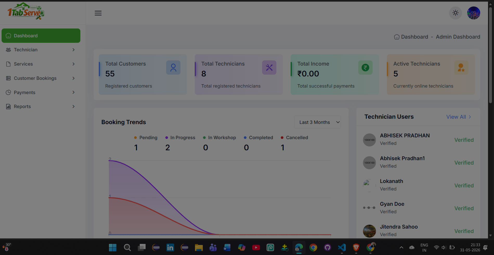
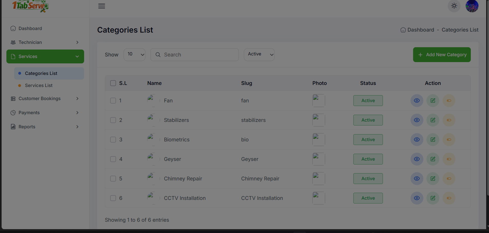
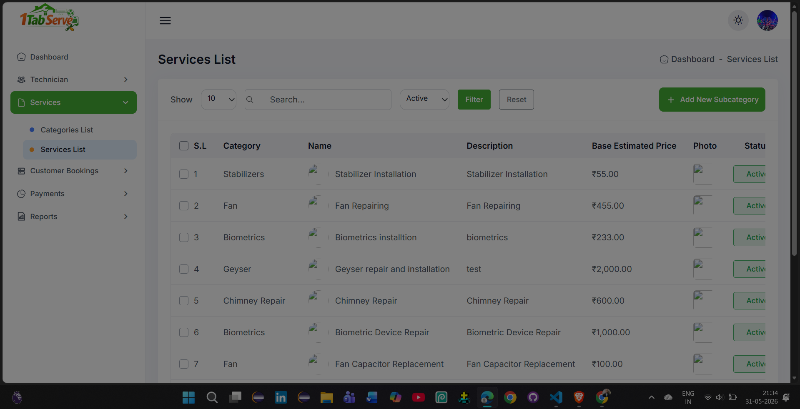
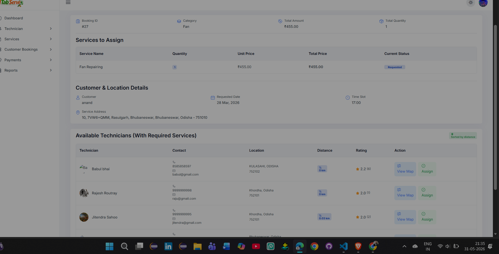
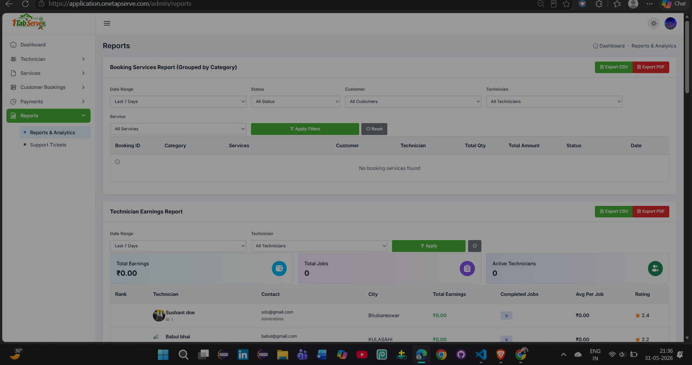
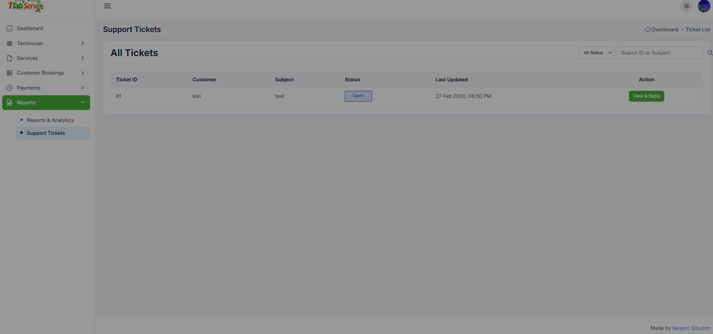

# 1TapServe – On-Demand Home Service Booking Platform

## Overview

1TapServe is a complete service marketplace platform that connects customers with skilled technicians for home and appliance-related services.

The platform consists of:

- Admin Panel (Web)
- Customer Mobile Application
- Technician Mobile Application
- REST APIs

Customers can browse available services, create bookings, receive quotations, track service status, and manage service requests.

Administrators manage services, categories, technicians, bookings, payments, reports, and service assignments.

Technicians receive assigned jobs, visit customer locations, generate quotations when required, update booking progress, and complete service requests.

---

## Core Business Flow

```text
Customer
    ↓
Browse Services
    ↓
Book Service
    ↓
Booking Created
    ↓
Admin Reviews Booking
    ↓
Nearby Qualified Technicians Identified
    ↓
Admin Assigns Technician
    ↓
Technician Visits Customer
    ↓
Inspection Performed
    ↓
 ┌──────────────────────────┐
 │ Standard Service Cost?   │
 └──────────────────────────┘
          ↓ Yes
     Start Work
          ↓
     Complete Job

          OR

          ↓ No
     Create Quotation
          ↓
     Customer Approval
          ↓
     Start Work
          ↓
     Complete Job

          OR

          ↓
Requires Service Center
          ↓
Status Changed To
"Service Center"
          ↓
Repair Process
          ↓
Complete Job
```

---

# System Architecture

## Admin Panel

The admin panel acts as the central control system for the platform.

### Responsibilities

- Manage Service Categories
- Manage Services
- Manage Technicians
- Manage Customers
- View and Manage Bookings
- Assign Technicians
- Track Live Booking Status
- Manage Payments
- View Reports & Analytics
- Handle Support Tickets

---

## Customer Mobile App

Customers can:

- Register/Login
- View Service Categories
- Browse Services
- Create Bookings
- Track Booking Status
- View Technician Information
- Receive Quotations
- Approve/Reject Quotations
- View Booking History
- Raise Support Tickets

---

## Technician Mobile App

Technicians can:

- Register/Login
- Update Availability
- Receive Assigned Jobs
- Navigate to Customer Location
- Update Service Status
- Generate Quotations
- Upload Repair Details
- Mark Service Center Cases
- Complete Jobs
- Track Earnings

---

# Major Features

## Dashboard & Analytics

Provides complete business visibility:

- Total Customers
- Total Technicians
- Active Technicians
- Revenue Tracking
- Booking Trends
- Service Statistics
- Top Customers
- Top Technicians
- Recent Activities

---

## Technician Management

Manage field technicians.

### Features

- Technician Registration
- Technician Verification
- Availability Tracking
- Active/Inactive Status
- Service Assignment
- Rating Tracking
- Location Tracking

---

## Service Management

### Category Management

Create and manage service categories.

Examples:

- Fan Services
- CCTV Installation
- Chimney Repair
- Biometric Devices
- Geyser Services
- Stabilizer Services

### Sub-Service Management

Manage individual services.

Examples:

- Fan Repair
- Fan Capacitor Replacement
- Fan Regulator Repair
- Biometric Device Repair
- CCTV Installation

### Features

- Service Pricing
- Status Management
- Service Images
- Service Descriptions

---

## Customer Booking Management

Customers can create service requests.

### Booking Details

- Service Selected
- Customer Information
- Service Address
- Preferred Time Slot
- Quantity
- Booking Amount

### Booking Statuses

- Requested
- Assigned
- In Progress
- Service Center
- Completed
- Cancelled

---

## Intelligent Technician Assignment

One of the core functionalities of the platform.

### Process

When a booking is created:

1. Customer location is captured.
2. Technician current location is tracked.
3. System calculates technician proximity.
4. Technicians capable of performing the selected service are identified.
5. Eligible technicians are displayed in an assignment list.
6. Admin assigns the most suitable technician.

### Assignment Factors

- Service Expertise
- Technician Availability
- Distance From Customer
- Technician Rating

---

## Quotation Management

Technicians can generate quotations after inspection.

### Scenario

If the service cannot be completed using the standard service cost:

Technician creates a quotation containing:

- Required Parts
- Repair Description
- Part Cost
- Labor Cost
- Total Cost

### Workflow

```text
Technician Inspection
        ↓
Quotation Created
        ↓
Customer Receives Quote
        ↓
Approve / Reject
        ↓
Work Starts
```

---

## Service Center Workflow

Certain repairs require workshop handling.

### Process

```text
Technician Inspection
        ↓
Requires Workshop Repair
        ↓
Status Changed To
"Service Center"
        ↓
Customer Notified
        ↓
Repair Process
        ↓
Service Completed
```

---

## Payment Management

Manage customer payments.

### Features

- Payment Recording
- Payment Status Tracking
- Booking Payment Mapping
- Transaction Reference Tracking

### Supported Payment Types

- Online Payment
- Cash Payment
- UPI
- Bank Transfer

---

## Reporting & Analytics

Advanced reporting system for operational monitoring.

### Available Reports

#### Booking Reports

- Service-wise Bookings
- Technician-wise Bookings
- Customer-wise Bookings
- Status-wise Bookings

#### Technician Reports

- Technician Performance
- Technician Ratings
- Completed Jobs
- Earnings Report

#### Customer Reports

- Customer Growth
- Booking History
- Customer Activity

#### Service Reports

- Category Reports
- Service Reports
- Popular Services

### Export Features

- CSV Export
- PDF Export

---

## Support Ticket System

Customer support management module.

### Features

- Ticket Creation
- Ticket Tracking
- Ticket Reply Management
- Status Tracking

---

# Location & Distance Tracking

The platform includes location-based technician assignment.

### Features

- Customer Location Capture
- Technician Live Location Tracking
- Distance Calculation
- Nearest Technician Suggestions
- Map Integration

This helps reduce response time and improves technician allocation efficiency.

---

# User Roles

## Admin

- Full System Access
- Booking Management
- Technician Assignment
- Reports Access
- Payment Management

## Customer

- Service Booking
- Quote Approval
- Booking Tracking
- Support Requests

## Technician

- Job Management
- Quote Creation
- Status Updates
- Service Completion

---

# Technology Stack

## Backend

- Laravel
- REST APIs
- MySQL

## Frontend

- Admin Panel (Web)
- Customer Mobile Application
- Technician Mobile Application

## Other Integrations

- Location Tracking
- Distance Calculation
- Notification System
- File Upload Management

---

# Key Highlights

- Multi-Role Platform
- Customer Mobile Application
- Technician Mobile Application
- Admin Management Portal
- Location-Based Technician Assignment
- Quotation Approval Workflow
- Service Center Workflow
- Real-Time Booking Tracking
- Reporting & Analytics
- Support Ticket Management
- CSV/PDF Export
- Scalable REST API Architecture

---

# Project Status

Production-ready service booking and technician management platform designed to streamline home-service operations, automate technician assignment, manage quotations, track service workflows, and improve customer experience through a centralized administration system.

# Screenshots

## Dashboard


## Technician Management


## Service Categories


## Services List


## Booking Management


## Technician Assignment


## Reports & Analytics


## Support Tickets

